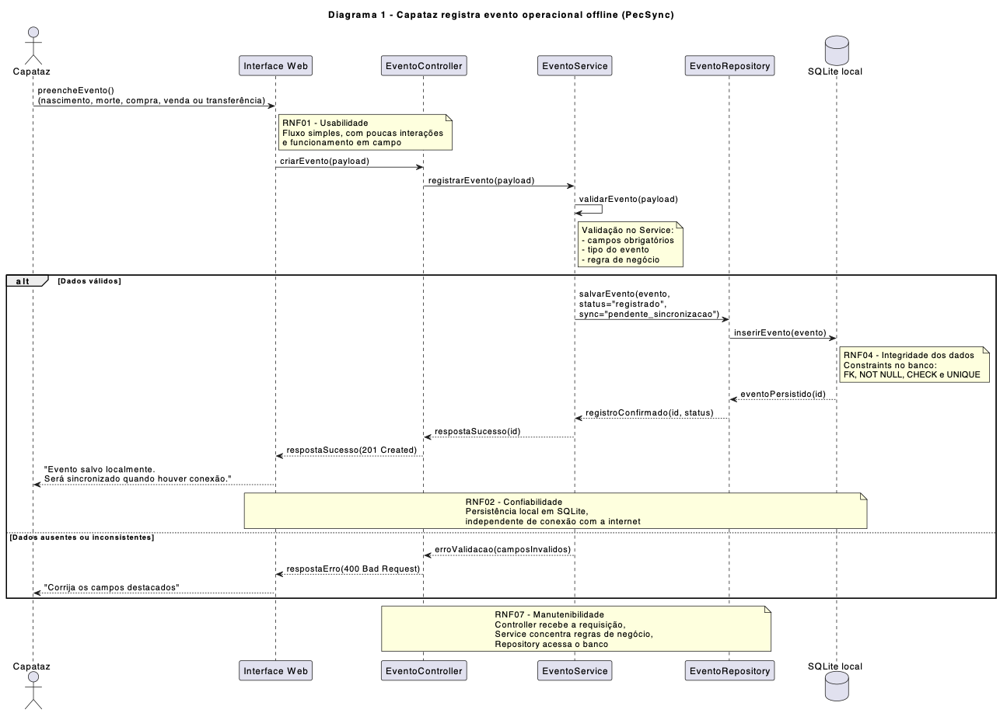
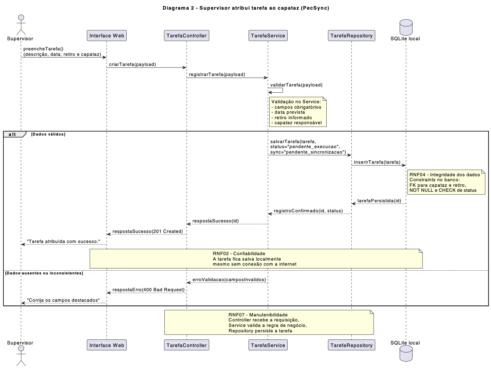
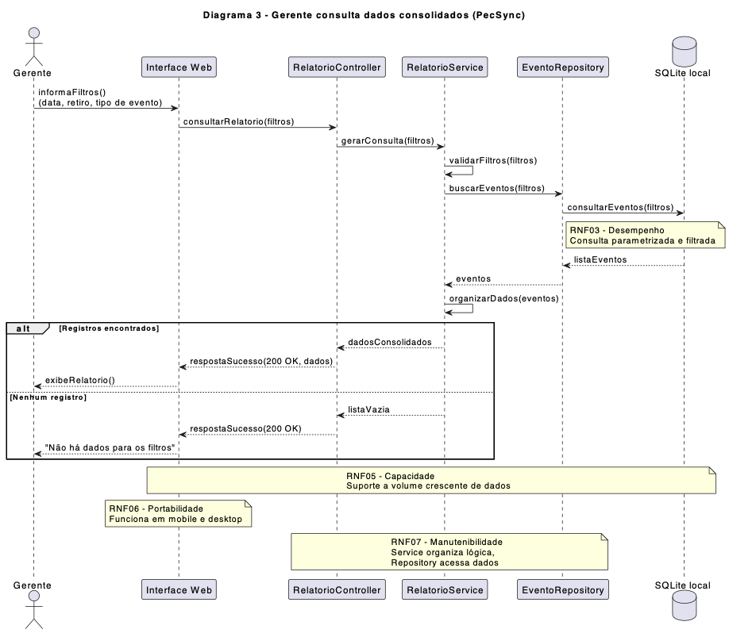

# Ponderada - Programação 1
### Giorgia Rigatti Scherer - T26

---
## Entrega mínima da atividade

- Tabela de RNF preenchida para os 8 eixos ISO/IEC 25010, com ao menos uma métrica ou critério concreto por eixo
- 3 diagramas de sequência com as 4 camadas `Controller → Service → Repository → Banco`, contendo fluxo principal e pelo menos 1 fluxo alternativo cada
- Tabela de rastreabilidade `RF → RNF → Diagrama` preenchida para os 3 diagramas

> Critério de qualidade: se o RNF não puder ser testado ou inspecionado, ele deve ser reescrito até se tornar verificável.

---

# Introdução 

&ensp; Esta atividade corresponde à primeira ponderação de Programação do Módulo 2 e tem como foco o desenvolvimento de requisitos não funcionais e de diagramas de sequência no contexto do projeto do grupo. O sistema analisado é a PecSync, proposta desenvolvida pelo Grupo 5 em parceria com a BRPEC, com o objetivo de apoiar a digitalização de registros operacionais realizados no campo.

&ensp; Ao longo da atividade, são apresentados os requisitos não funcionais do sistema com critérios técnicos e verificáveis, além da relação desses requisitos com a arquitetura adotada no projeto. Também são discutidos os fluxos principais por meio de diagramas de sequência UML, considerando a organização em camadas da aplicação e a forma como essa estrutura contribui para aspectos como integridade, persistência local e manutenção do sistema.

---

## Tabela de Requisitos Não Funcionais

| Eixo ISO/IEC 25010 | Código | Requisito Não Funcional | Métrica / Critério objetivo | Forma de validação |
|---|---|---|---|---|
| Usabilidade | RNF01 | O sistema deve permitir que o capataz registre eventos operacionais com baixa carga cognitiva e fluxo simples. | O registro deve ser concluído em até 3 interações obrigatórias, sem troca de tela. | Teste de uso com simulação de cadastro de evento em dispositivo mobile. |
| Confiabilidade | RNF02 | O sistema deve preservar localmente os dados registrados em cenários sem conexão. | 100% dos registros criados offline devem permanecer armazenados localmente até sincronização posterior. | Teste com rede indisponível e verificação do banco SQLite local. |
| Desempenho | RNF03 | O sistema deve responder rapidamente às operações locais de consulta e leitura. | 95% das consultas com até 100 registros devem responder em menos de 300ms. | Teste de tempo de resposta em consultas locais parametrizadas. |
| Segurança / Integridade | RNF04 | O sistema deve proteger a integridade e a rastreabilidade dos dados registrados. | Nenhum registro deve ser salvo sem respeitar constraints mínimas como `FK`, `NOT NULL`, `CHECK` e `UNIQUE`. | Inspeção do esquema do banco e testes com dados inválidos. |
| Capacidade | RNF05 | O sistema deve suportar crescimento no volume de registros operacionais. | O sistema deve operar com até 10 mil registros locais sem degradação perceptível nas consultas principais. | Teste com massa de dados no SQLite e avaliação de tempo de resposta. |
| Portabilidade | RNF06 | O sistema deve funcionar nos principais dispositivos utilizados no campo e no escritório. | Compatibilidade funcional em navegadores modernos mobile e desktop. | Testes em navegadores atuais de celular e computador. |
| Manutenibilidade | RNF07 | O sistema deve manter separação clara entre controle de requisições, regras de negócio e persistência. | As regras de negócio devem permanecer concentradas na camada `Service`, sem lógica de negócio no `Controller` ou no `Repository`. | Revisão de código com inspeção da distribuição de responsabilidades. |
| Compatibilidade | RNF08 | O sistema deve manter consistência entre dados locais e sincronização posterior. | Dados salvos localmente devem manter status de sincronização e não gerar duplicidade quando sincronizados. | Teste de sincronização posterior com verificação de status e unicidade. |

&ensp; Os RNFs acima foram definidos pensando no contexto real de uso da PecSync. Em um sistema comum de escritório, talvez desempenho visual ou integração imediata com rede fossem as prioridades centrais. Aqui, no entanto, o ponto mais sensível está na necessidade de o dado ser registrado corretamente no campo, permanecer salvo localmente e continuar íntegro até o momento em que a sincronização puder acontecer. Por isso, confiabilidade, integridade e rastreabilidade foram priorizados na formulação dos critérios.

&ensp; Também foi importante manter esses requisitos alinhados à arquitetura do MVP. Como o projeto adota a separação `Controller → Service → Repository → SQLite`, cada RNF pode ser observado em decisões concretas do sistema. A usabilidade aparece na forma como a interface reduz passos para o capataz. A integridade aparece nas validações da camada de serviço e nas constraints do banco. Já a manutenibilidade depende diretamente de não misturar regra de negócio com acesso a dados.

--- 

## Sobre os diagramas de sequência

&ensp; Os três diagramas de sequência definidos foram organizados para acompanhar o caminho natural da informação dentro da operação da BRPEC. Primeiro, o capataz registra o que aconteceu em campo. Depois, o supervisor estrutura a execução do trabalho por meio da atribuição de tarefas. Por fim, o gerente consulta os dados já registrados para acompanhar a operação. Essa ordem ajuda a mostrar que a arquitetura não está ali só como desenho técnico, mas como suporte para o ciclo real de uso do sistema.

&ensp; Em todos os diagramas, a mesma base arquitetural foi mantida, de forma que a interface web dispara a ação, o `Controller` recebe a requisição, o `Service` aplica as regras de negócio, o `Repository` acessa a persistência e o SQLite local armazena ou recupera os dados. Essa padronização faz sentido no contexto da PecSync (solução proposta pelo grupo 05), pois reduz acoplamento e deixa mais claro onde cada decisão deve ficar. No caso de um sistema offline-first, isso é extremamente relevante, já que o fluxo precisa continuar confiável mesmo sem depender de serviços externos.

---

### Diagrama 1 - Capataz registra evento operacional offline

Figura 1 - Diagrama de sequência UML do registro de evento operacional offline.

Fonte: Autoria própria (2026).

&ensp; O primeiro diagrama representa o núcleo do problema que a PecSync tenta resolver, que é a substituição dos registros manuais na boleta por um registro digital feito no momento em que o evento acontece. Nesse fluxo, o capataz informa os dados do evento diretamente na interface web, sem depender de internet para concluir a ação.

&ensp; Depois do preenchimento, a requisição segue para o `EventoController`, que recebe os dados e encaminha o processamento. Em seguida, o `EventoService` valida os campos obrigatórios, verifica o tipo de evento informado e aplica as regras mínimas necessárias para que o registro faça sentido dentro da operação. Só depois disso o `EventoRepository` persiste a informação no SQLite local. Essa sequência reforça que a validação principal não deve ficar espalhada entre interface e banco, mas centralizada onde a regra de negócio realmente pertence.

&ensp; No fluxo principal, o evento é salvo localmente com status de sincronização pendente. Isso materializa a ideia de offline-first, ou seja, mesmo que a conexão não exista naquele momento, o dado continua preservado e rastreável. Já no fluxo alternativo, quando faltam campos obrigatórios ou alguma regra básica é violada, o sistema retorna erro sem gravar um registro inconsistente. Esse comportamento se conecta diretamente ao RNF01, porque o uso precisa ser simples para o capataz, e ao RNF02 e RNF04, porque simplicidade não pode significar perda de confiabilidade ou quebra de integridade.

---

### Diagrama 2 - Supervisor atribui tarefa ao capataz

Figura 2 - Diagrama de sequência UML da atribuição de tarefa ao capataz.

Fonte: Autoria própria (2026).

&ensp; O segundo diagrama desloca o foco do registro do fato ocorrido para a organização do trabalho. Aqui, o supervisor utiliza o sistema para criar e atribuir tarefas operacionais, definindo informações como descrição, data prevista, retiro e capataz responsável. Isso amplia o papel da PecSync dentro da operação, já que o sistema deixa de ser apenas um repositório de eventos passados e passa também a apoiar a coordenação das atividades.

&ensp; No fluxo principal, a interface envia a solicitação ao `TarefaController`, que repassa os dados ao `TarefaService`. Nessa camada, são feitas as validações necessárias para garantir que a tarefa tenha dados mínimos coerentes antes da persistência. O `TarefaRepository`, então, grava a tarefa no SQLite local com os status apropriados, como pendência de execução e de sincronização, conforme a modelagem adotada no MVP.

&ensp; O fluxo alternativo aparece quando a tarefa tenta ser criada com associação inválida ou com dados obrigatórios ausentes. Nessa situação, o sistema deve interromper o processo antes da gravação. Esse ponto é importante porque mostra que o offline-first não significa aceitar qualquer dado e corrigir depois. Pelo contrário, como a sincronização ocorre em momento posterior, o registro local já precisa nascer consistente. Por isso, esse diagrama conversa principalmente com o RNF02, o RNF04, o RNF07 e também com o RNF08, já que a própria tarefa já precisa manter rastreabilidade do seu estado para futura sincronização.

---

### Diagrama 3 - Gerente consulta dados consolidados

Figura 3 - Diagrama de sequência UML da consulta de dados consolidados pelo gerente.

Fonte: Autoria própria (2026).

&ensp; O terceiro diagrama fecha o ciclo operacional ao mostrar o uso gerencial dos dados já registrados. Nesse caso, o valor do sistema aparece na capacidade de transformar registros de campo em informação consultável para acompanhamento e tomada de decisão. O gerente não interage com a camada de persistência de forma direta, ele utiliza filtros na interface, e o restante do processamento continua respeitando a arquitetura em camadas.

&ensp; No fluxo principal, a consulta parte da interface web e chega ao `RelatorioController`, que aciona o `RelatorioService`. Essa camada verifica os filtros informados, organiza a lógica da consulta e solicita ao repositório a busca no banco local. O `Repository` executa a consulta parametrizada no SQLite e devolve os resultados para apresentação na interface. Esse encadeamento faz sentido porque impede que a regra da consulta fique embutida no controlador ou diretamente na camada visual.

&ensp; O fluxo alternativo acontece quando os filtros não retornam registros. Nesse cenário, o sistema devolve uma lista vazia ou uma mensagem adequada, em vez de tratar a ausência de dados como erro técnico. Essa decisão melhora a experiência de uso e mantém a coerência funcional da consulta. Além disso, o diagrama se relaciona diretamente ao RNF03 e ao RNF05, porque o acesso local precisa continuar rápido mesmo com crescimento do volume de registros, e também ao RNF06 e RNF07, já que a consulta deve funcionar nos dispositivos previstos sem romper a separação entre responsabilidades.

---

##  Tabela de rastreabilidade RF → RNF → Diagrama

| Diagrama | Requisito Funcional relacionado | RNFs relacionados | Justificativa |
|---|---|---|---|
| Diagrama 1 - Capataz registra evento operacional offline | RF01: O sistema deve permitir que o capataz registre eventos operacionais no campo. | RNF01, RNF02, RNF04, RNF07, RNF08 | O fluxo trata o momento em que o dado nasce no sistema. Por isso, exige interface simples, persistência local sem dependência de rede, validação das regras mínimas antes da gravação, separação entre camadas e definição de status de sincronização para uso posterior. |
| Diagrama 2 - Supervisor atribui tarefa ao capataz | RF02: O sistema deve permitir que o supervisor crie e atribua tarefas operacionais aos capatazes. | RNF02, RNF04, RNF07, RNF08 | A atribuição precisa continuar funcionando offline, com consistência entre os vínculos da tarefa e os dados já existentes. A arquitetura em camadas ajuda a manter a regra de criação organizada, e o controle de status prepara a tarefa para sincronização futura sem duplicidade. |
| Diagrama 3 - Gerente consulta dados consolidados | RF03: O sistema deve permitir que o gerente consulte registros operacionais por filtros. | RNF03, RNF05, RNF06, RNF07 | A consulta consolidada depende de resposta rápida, suporte a crescimento do volume de dados locais, funcionamento em dispositivos de campo e escritório e manutenção da lógica de filtros na camada `Service`, sem acoplamento indevido entre interface e persistência. |

---

## Constraints e decisões técnicas relacionadas aos fluxos

&ensp; A seguir, esta tabela apresenta algumas constraints e decisões técnicas relacionadas aos fluxos principais do sistema. A proposta é evidenciar que as ações representadas nos diagramas não dependem apenas da passagem da requisição entre as camadas, mas também de mecanismos que ajudam a garantir a consistência do dado no momento em que ele é salvo.

&ensp; Nesse contexto, as constraints podem ser entendidas como restrições definidas no próprio banco de dados para impedir que registros inválidos sejam persistidos. No caso da PecSync, isso é relevante, pois o sistema foi pensado para operar offline-first, então o dado precisa nascer íntegro e permanecer confiável mesmo antes de uma sincronização posterior. Assim, a tabela ajuda a mostrar, de forma mais concreta, como constraints e outras decisões técnicas sustentam a confiabilidade, a integridade e a rastreabilidade esperadas no sistema.

| Fluxo | Constraint / decisão técnica | Finalidade no sistema |
|---|---|---|
| Capataz registra evento operacional | `NOT NULL` nos campos obrigatórios do evento | Impedir o salvamento de registros incompletos |
| Capataz registra evento operacional | `FK` para bovino, retiro e capataz | Garantir que o evento esteja vinculado a dados existentes e válidos |
| Supervisor atribui tarefa ao capataz | `FK` para capataz responsável | Evitar associação com um capataz inexistente |
| Supervisor atribui tarefa ao capataz | `NOT NULL` em descrição e data prevista | Garantir consistência mínima na criação da tarefa |
| Gerente consulta dados consolidados | Consulta parametrizada no `Repository` | Organizar a busca de dados de forma consistente com os filtros informados |
| Todos os fluxos | Status de sincronização persistido localmente | Manter rastreabilidade dos registros no contexto offline-first |

De forma resumida, as principais constraints usadas nesse contexto são:

- `NOT NULL`: indica que um campo obrigatório não pode ficar vazio no momento do salvamento.
- `FK` (`Foreign Key`): cria uma ligação entre tabelas e impede que um registro aponte para outro dado que não existe.
- `CHECK`: limita os valores aceitos em um campo, evitando entradas fora do padrão definido pela regra de negócio.
- `UNIQUE`: impede duplicidade em campos que precisam ser exclusivos dentro do sistema.
